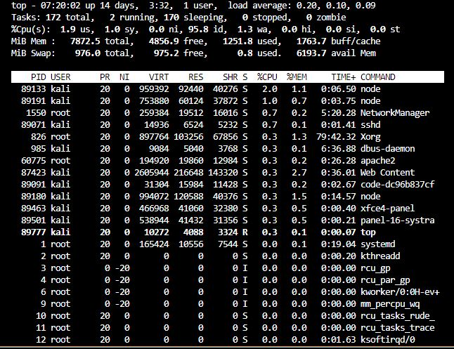
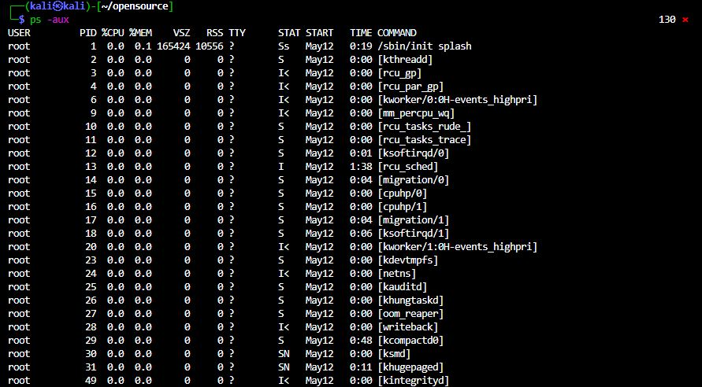
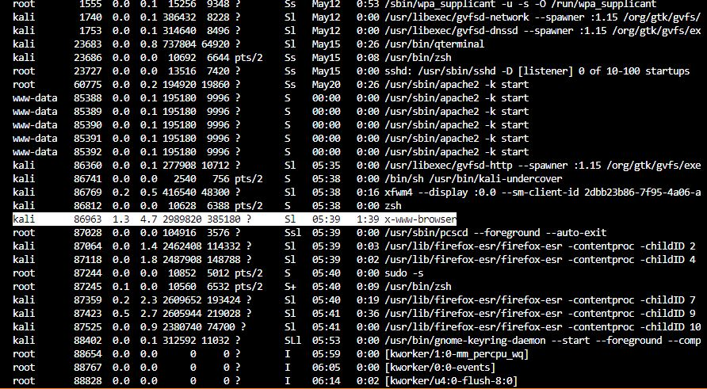
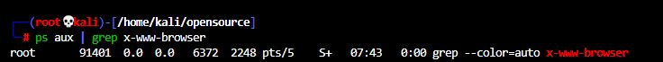

# opensourcesoftware 과제 입니다
# 20243135 김광영

## 알아볼 리눅스 명령어 
* top
* ps
* jobs
* kill

### 첫번째, top

1. **top** 명령어는 실시간으로 시스템의 프로세스 상태를 보여주는 도구 
2. 속성 : CPU 사용량, 메모리 사용량, 실행 중인 프로세스 목록 등 다양한 정보를 제공
3. top의 주요 단축키
    - **q** : 종료
    - **h** : 도움말
    - **k** : 특정 프로세스 종료
    - **P** : CPU 사용량 기준으로 정렬
    - **M** : 메모리 사용량 기준으로 정렬~

<실습 이미지>
top 명령어 실행 화면

### 두번째, ps
1. **ps** 명령어는 현재 시스템에서 실행 중인 프로세스 목록을 출력함
2. 다양한 옵션을 사용하여 프로세스 정보를 세부적으로 확인할 수 있음.
3. 형태 : 'ps [옵션]'
4. 옵션 표 정리

| aux | ef | p |
|-------|-------|-------|
| 프로세스 표시   | 프로세스 정보를 부모-자식 관계를 트리 형태로 표현   | 특정 프로세스 id에 대한 정보를 표시   |

<실습 이미지>
ps -aux를 실행한 모습

### 세번째, jobs
1. **jobs**명령어는 현재 셸에서 백그라운드로 실행 중인 작업 목록을 표시
2. 주로 셸 내에서 작업을 관리할 때 사용
3. 형태 : 'jobs [옵션]'
    * jobs -l : 각 작업의 프로세스 id를 포함한 상세 정보를 표시
    * jobs -r : 실행 중인 작업만 표시
    * jobs -s : 몀춰 있는 작업만 표시

<실습 이미지 생략>

### 네번째, kill
1. **kill** 명령어는 특정 프로세스에 신호를 보내어 종료하거나 다른 신호를 전달하는 데 사용
2. 주로 프로세스를 종료할 때 사용되지만, 다양한 신호를 사용할 수 있음
3. 형태 : 'kill [옵션] <PID>'
    - kill -9 <PID> : 강제로 프로세스를 종료
    - kill -15 <PID> : 정상적으로 프로세스를 종료
    - kill -l : 신호 목록을 표시

<실습 이미지 3개>
ps aux 명령어를 통해 x-www-browser 종료
다 끝난 후, 프로세스가 잘 종료 되었는지 **ps aux | grep x-www-browser**을 통해 확인

  
